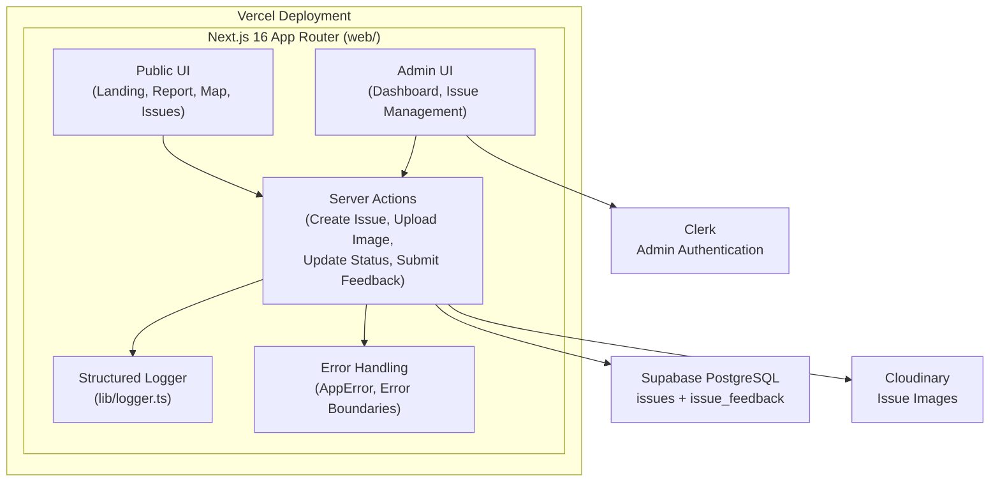
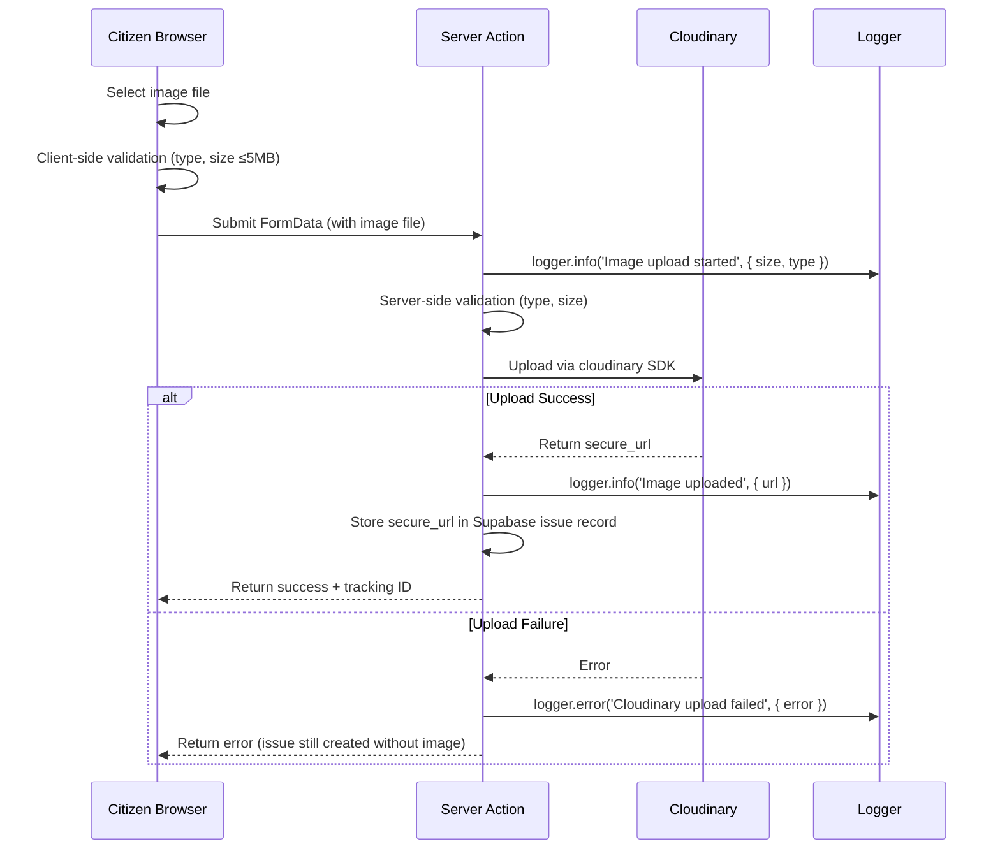
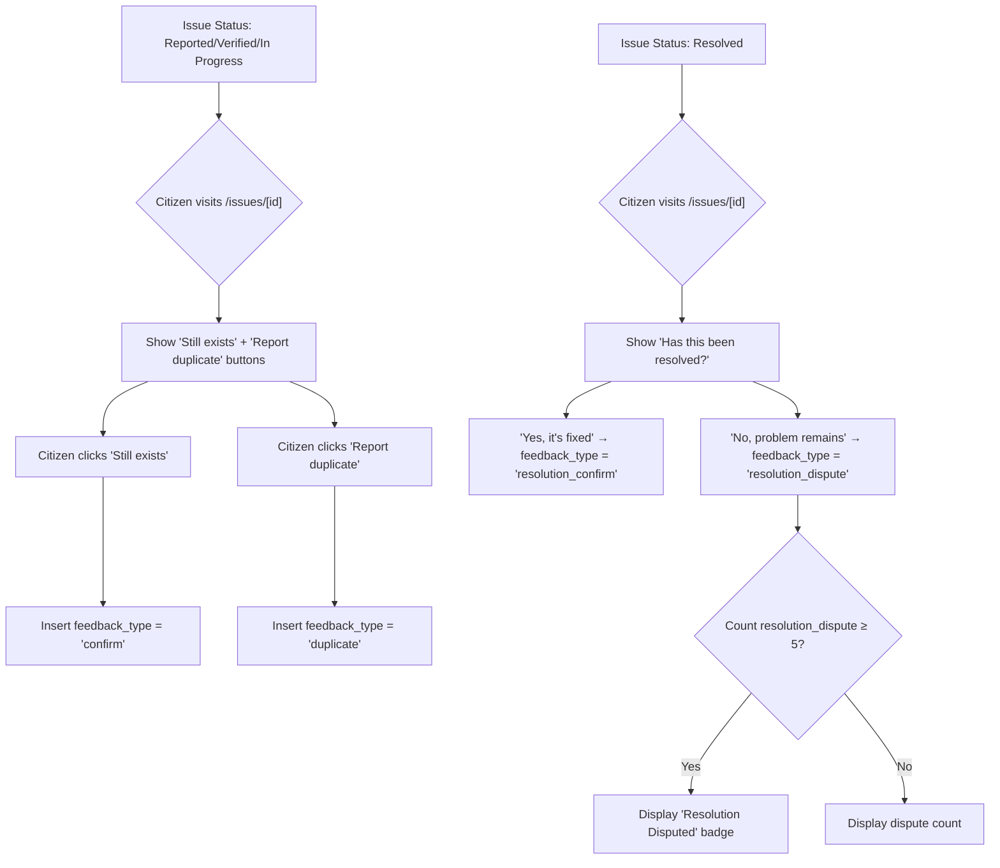

# FixSL — Implementation Plan (v2 — Updated)

> **Citizen-powered Sri Lankan infrastructure issue reporting and tracking platform**
> 
> 4-hour university hackathon MVP · 4 developers · `dev` branch

> [!NOTE]
> **v2 Changes**: Updated to reflect the already-initialized Next.js 16.3.4 project in `web/`, added comprehensive logging & error handling strategy, corrected all file paths, and adapted for Tailwind CSS v4.

---

## 1. Current Repository Analysis

| Aspect | Finding |
|---|---|
| **Framework** | ✅ Next.js 16.3.4 initialized in [`web/`](file:///c:/nadil-dulnidu/FixSL/web) |
| **React** | ✅ React 19.2.8 |
| **Tailwind** | ✅ Tailwind CSS v4 via `@tailwindcss/postcss` (new syntax — no `tailwind.config.ts`) |
| **TypeScript** | ✅ Strict mode, bundler resolution, `@/*` path alias |
| **Font** | ⚠️ Currently Geist — needs to change to **Poppins** |
| **Leaflet types** | ✅ `@types/leaflet` already in devDependencies |
| **Layout** | ✅ Root layout uses Next.js 16's typed `LayoutProps<"/">` pattern |
| **CSS** | ✅ `globals.css` with `@import "tailwindcss"` and `@theme inline` block |
| **shadcn/ui** | ❌ Not installed yet |
| **Clerk** | ❌ Not installed yet |
| **Supabase** | ❌ Not installed yet |
| **Cloudinary** | ❌ Not installed yet |
| **Logger** | ❌ `lib/` is empty — logger needs to be created |
| **Pages** | ⚠️ Default boilerplate `page.tsx` — needs replacement |
| **ESLint** | ✅ `eslint-config-next` configured |
| **PostCSS** | ✅ `postcss.config.mjs` with `@tailwindcss/postcss` |
| **Project location** | `web/` subdirectory (not repo root) |

### What Can Be Reused
- Next.js 16 setup, TypeScript config, ESLint config, PostCSS config
- `@types/leaflet` devDependency
- Root `layout.tsx` structure (modify font + add providers)
- `globals.css` structure (extend with theme + claymorphism)
- `.gitignore` configuration

### What Needs to Be Created
- All application pages and components
- Logging utility (`lib/logger.ts`)
- Error handling utilities
- Supabase client + schema + seed
- Clerk middleware + auth pages
- Cloudinary upload logic
- shadcn/ui installation + components
- All Server Actions
- Map components

### Important: Tailwind CSS v4 Differences

> [!WARNING]
> This project uses **Tailwind CSS v4**, which has significant differences from v3:
> - **No `tailwind.config.ts`** — configuration goes in CSS via `@theme inline { }` blocks
> - **No `@apply`** — use CSS custom properties or direct classes
> - **`@import "tailwindcss"`** replaces the old `@tailwind base/components/utilities` directives
> - **shadcn/ui compatibility** — must use shadcn v2+ which supports Tailwind v4

---

## 2. Proposed Architecture



**Key architectural decisions:**
- Single Next.js 16 application in `web/` — no separate backend
- App Router with Server Components for data fetching, Client Components for interactivity
- Server Actions for all mutations (issue creation, status updates, image uploads, feedback)
- **Structured logging** via custom logger — dev-colored console, production-filtered
- **Layered error handling** — Zod validation → AppError classes → Server Action wrappers → Error Boundaries
- Clerk protects admin routes via middleware
- Supabase JS client with RLS for database access
- Cloudinary uploads handled server-side (secrets never exposed)
- Anonymous citizen reporting (no auth required)

---

## 3. Route / Page Structure

> All paths below are relative to `web/app/`

```
web/app/
├── (public)/                    # Route group — public layout (navbar, footer)
│   ├── layout.tsx               # Public layout with navigation
│   ├── page.tsx                 # Landing page (/)
│   ├── report/
│   │   └── page.tsx             # Report issue form (/report)
│   ├── map/
│   │   └── page.tsx             # Community map & analytics (/map)
│   └── issues/
│       └── [id]/
│           └── page.tsx         # Public issue detail + verification (/issues/[id])
│
├── admin/                       # Admin area — separate layout, Clerk-protected
│   ├── layout.tsx               # Admin layout (sidebar, admin nav)
│   ├── page.tsx                 # Admin dashboard (/admin)
│   └── issues/
│       ├── page.tsx             # Issue management table (/admin/issues)
│       └── [id]/
│           └── page.tsx         # Admin issue detail (/admin/issues/[id])
│
├── sign-in/[[...sign-in]]/
│   └── page.tsx                 # Clerk sign-in page
├── sign-up/[[...sign-up]]/
│   └── page.tsx                 # Clerk sign-up page
│
├── layout.tsx                   # Root layout (fonts, providers, Toaster) ← MODIFY existing
├── globals.css                  # Global styles + claymorphism ← MODIFY existing
├── error.tsx                    # Global error boundary
└── not-found.tsx                # Custom 404 page
```

---

## 4. Component Structure

> All paths below are relative to `web/components/`

```
web/components/
├── ui/                          # shadcn/ui components (auto-generated)
│   ├── button.tsx
│   ├── card.tsx
│   ├── badge.tsx
│   ├── input.tsx
│   ├── textarea.tsx
│   ├── select.tsx
│   ├── table.tsx
│   ├── dialog.tsx
│   ├── skeleton.tsx
│   └── ...
│
├── layout/
│   ├── navbar.tsx               # Public navigation bar
│   ├── footer.tsx               # Public footer
│   ├── admin-sidebar.tsx        # Admin sidebar navigation
│   └── mobile-nav.tsx           # Mobile hamburger menu
│
├── landing/
│   ├── hero-section.tsx         # Hero with headline + CTA
│   ├── how-it-works.tsx         # Step-by-step lifecycle explanation
│   ├── stats-section.tsx        # Live statistics cards
│   └── track-issue.tsx          # Tracking ID search input
│
├── report/
│   ├── report-form.tsx          # Main report form (client component)
│   ├── location-picker.tsx      # Leaflet map pin picker (client component)
│   ├── image-upload.tsx         # Image upload with preview + validation
│   └── report-success.tsx       # Success screen with tracking ID
│
├── map/
│   ├── issue-map.tsx            # Leaflet map with markers (client component)
│   ├── map-filters.tsx          # Category/status filter controls
│   ├── map-marker-popup.tsx     # Marker popup content
│   └── map-stats.tsx            # Analytics sidebar/section
│
├── issues/
│   ├── issue-detail-card.tsx    # Issue info display
│   ├── issue-status-badge.tsx   # Status badge (Reported/Verified/In Progress/Resolved)
│   ├── priority-badge.tsx       # Priority badge (Low/Medium/High/Critical)
│   ├── category-badge.tsx       # Category icon + label
│   ├── verification-panel.tsx   # Community verification voting UI
│   └── resolution-feedback.tsx  # Post-resolution confirm/dispute UI
│
├── admin/
│   ├── stats-cards.tsx          # Dashboard summary cards
│   ├── issues-table.tsx         # Issue management data table
│   ├── issue-filters.tsx        # Admin filter controls
│   ├── status-update.tsx        # Status change dropdown/dialog
│   └── priority-update.tsx      # Priority change dropdown
│
├── shared/
│   ├── loading-spinner.tsx      # Animated spinner
│   ├── error-message.tsx        # Reusable error display
│   └── empty-state.tsx          # Reusable empty state display
│
└── error-boundary.tsx           # Client-side error boundary wrapper
```

---

## 5. Database Schema

### Table: `issues`

| Column | Type | Constraints | Notes |
|---|---|---|---|
| `id` | `uuid` | PK, default `gen_random_uuid()` | Internal ID |
| `tracking_number` | `integer` | NOT NULL, UNIQUE, auto-increment (sequence starting at 1001) | Generates FIX-1001, FIX-1002, etc. |
| `title` | `text` | NOT NULL | Issue title |
| `description` | `text` | NOT NULL | Detailed description |
| `category` | `text` | NOT NULL, CHECK constraint | `pothole`, `road_damage`, `broken_streetlight`, `garbage`, `blocked_drain`, `other` |
| `status` | `text` | NOT NULL, default `'reported'` | `reported`, `verified`, `in_progress`, `resolved` |
| `priority` | `text` | NOT NULL, default `'medium'` | `low`, `medium`, `high`, `critical` |
| `latitude` | `double precision` | NOT NULL | GPS latitude |
| `longitude` | `double precision` | NOT NULL | GPS longitude |
| `location_name` | `text` | | Human-readable location (via reverse geocoding) |
| `image_url` | `text` | | Cloudinary secure URL |
| `created_at` | `timestamptz` | default `now()` | Submission time |
| `updated_at` | `timestamptz` | default `now()` | Last update time |

### Table: `issue_feedback`

| Column | Type | Constraints | Notes |
|---|---|---|---|
| `id` | `uuid` | PK, default `gen_random_uuid()` | |
| `issue_id` | `uuid` | NOT NULL, FK → issues(id) ON DELETE CASCADE | |
| `feedback_type` | `text` | NOT NULL, CHECK constraint | `confirm`, `dispute`, `resolution_confirm`, `resolution_dispute` |
| `session_id` | `text` | NOT NULL | localStorage-generated anonymous ID for dedup |
| `created_at` | `timestamptz` | default `now()` | |

**Unique constraint**: `(issue_id, session_id, feedback_type)` — prevents same session from submitting duplicate feedback of the same type on the same issue.

### Sequence

```sql
CREATE SEQUENCE issue_tracking_seq START WITH 1001;
```

`tracking_number` defaults to `nextval('issue_tracking_seq')`.

### Indexes

- `issues(status)` — for dashboard filtering
- `issues(category)` — for map/dashboard filtering
- `issues(tracking_number)` — for lookup by tracking ID
- `issue_feedback(issue_id)` — for counting feedback per issue

### Row Level Security

**`issues` table:**
```sql
-- Anyone can read issues (public data)
CREATE POLICY "Public read access" ON issues FOR SELECT USING (true);
-- Only server (service role) can insert/update
CREATE POLICY "Service role insert" ON issues FOR INSERT WITH CHECK (true);
CREATE POLICY "Service role update" ON issues FOR UPDATE USING (true);
```

**`issue_feedback` table:**
```sql
-- Anyone can read feedback counts
CREATE POLICY "Public read access" ON issue_feedback FOR SELECT USING (true);
-- Anyone can insert feedback (anonymous)
CREATE POLICY "Public insert" ON issue_feedback FOR INSERT WITH CHECK (true);
-- No update/delete allowed
```

> [!NOTE]
> Admin mutations (status changes, priority changes) go through Server Actions that use the **service role key** to bypass RLS, with Clerk auth checks in the server action code itself.

---

## 6. Supabase Integration Approach

```
web/lib/supabase/
├── client.ts               # Browser client (anon key) — for public reads
├── server.ts               # Server client (service role key) — for mutations
└── types.ts                # Generated TypeScript types from Supabase
```

- **Public reads** (issue list, map data, issue details): Use `anon` key client
- **All mutations** (create issue, update status, submit feedback, upload image): Use `service_role` key in Server Actions
- Types generated via `npx supabase gen types typescript` from the remote project
- **All Supabase calls wrapped in try/catch with logger** (see Section 13)

---

## 7. Clerk Authentication Approach

### Middleware ([`web/middleware.ts`](file:///c:/nadil-dulnidu/FixSL/web/middleware.ts))

- Protect `/admin/*` routes — redirect unauthenticated users to `/sign-in`
- Allow all other routes as public
- Use `clerkMiddleware()` with `createRouteMatcher` for `/admin(.*)`

### Admin Authorization

- Set `role: "admin"` in **Clerk public metadata** for admin users (via Clerk Dashboard)
- Check `auth().sessionClaims?.metadata?.role === "admin"` in:
  - Admin layout (for UI-level protection)
  - Every admin Server Action (for mutation-level protection)
- **Log authorization failures** via `logger.warn()`

### Clerk Pages

- `web/app/sign-in/[[...sign-in]]/page.tsx` — Custom Clerk sign-in page
- `web/app/sign-up/[[...sign-up]]/page.tsx` — Custom Clerk sign-up page

### Required Clerk Config

In Clerk Dashboard → Sessions → Customize session token:
```json
{
  "metadata": "{{user.public_metadata}}"
}
```

---

## 8. Cloudinary Upload Architecture



**Implementation:**
- `web/lib/cloudinary.ts` — Cloudinary SDK configuration (server-only)
- Image upload happens inside the `createIssue` Server Action
- Accepted types: `image/jpeg`, `image/png`, `image/webp`
- Max size: 5 MB
- Cloudinary folder: `fixsl/issues/`
- Transformation on upload: auto quality, max width 1200px
- **Fallback**: If upload fails, issue is still created without image + error logged

---

## 9. Map Implementation Approach

### Libraries
- `leaflet` — Core map library
- `react-leaflet` — React bindings for Leaflet

### Two Map Components

1. **Location Picker** (`web/components/report/location-picker.tsx`)
   - Used on the report form
   - Centered on Colombo (6.9271°N, 79.8612°E), zoom 13
   - Click to place/move a draggable marker
   - Returns `{ lat, lng }` to parent form
   - On pin placement: reverse geocode via Nominatim API to auto-fill `location_name`

2. **Community Map** (`web/components/map/issue-map.tsx`)
   - Used on the /map page
   - Shows all issues as colored markers (color by category or status)
   - Click marker → popup with issue summary + link to `/issues/[id]`
   - Filters for category and status

### Leaflet CSS & SSR
- Import Leaflet CSS in the map component
- Use `next/dynamic` with `ssr: false` for both map components (Leaflet requires `window`)
- **Log map initialization and errors** via logger

### Reverse Geocoding
- Nominatim API: `https://nominatim.openstreetmap.org/reverse?lat=X&lon=Y&format=json`
- Client-side call when pin is placed
- Rate limit: 1 req/sec — with error handling if rate limited

---

## 10. Community Verification Implementation

### Feedback Flow



### Deduplication
- Generate a random `session_id` UUID on first visit, store in `localStorage`
- Send `session_id` with every feedback submission
- Database UNIQUE constraint on `(issue_id, session_id, feedback_type)` prevents duplicates
- Client checks localStorage to disable buttons if already voted
- **Log duplicate attempts**: `logger.info('Duplicate feedback blocked', { issueId, sessionId })`

### Display
- Show aggregated counts: "12 citizens confirmed · 3 citizens disputed"
- If resolved and `resolution_dispute` count ≥ 5: show **"⚠️ Resolution Disputed"** badge

---

## 11. Admin Authorization Strategy

| Layer | Mechanism | Purpose | Logging |
|---|---|---|---|
| **Route** | Clerk middleware | Redirect unauthenticated users from `/admin/*` to `/sign-in` | Middleware logs redirects |
| **Layout** | `auth()` check in admin `layout.tsx` | Show 403 if user lacks `admin` role | `logger.warn('Unauthorized admin access attempt')` |
| **Server Action** | `auth()` check at top of every admin action | Reject unauthorized mutations with error | `logger.error('Unauthorized admin mutation', { userId, action })` |
| **Database** | RLS + service role key | Service role bypasses RLS; anon key can only SELECT | Supabase error logs |

---

## 12. Validation Strategy

### Library: Zod

### Schemas ([`web/lib/validations/`](file:///c:/nadil-dulnidu/FixSL/web/lib/validations/))

**`issue.ts`** — Issue creation schema:
```
- category: enum (pothole | road_damage | broken_streetlight | garbage | blocked_drain | other) — required
- title: string, min 5, max 100 — required
- description: string, min 20, max 1000 — required
- latitude: number, range -90 to 90 — required
- longitude: number, range -180 to 180 — required
- location_name: string, max 200 — optional
- image: File, max 5MB, type jpeg/png/webp — optional
```

**`feedback.ts`** — Feedback submission schema:
```
- issue_id: uuid — required
- feedback_type: enum (confirm | dispute | resolution_confirm | resolution_dispute) — required
- session_id: uuid — required
```

**`admin.ts`** — Admin update schemas:
```
- status: enum (reported | verified | in_progress | resolved) — required
- priority: enum (low | medium | high | critical) — required
```

### Validation UX
- Client-side: Zod + `react-hook-form` with `@hookform/resolvers/zod` for instant feedback
- Server-side: Same Zod schema validated in Server Actions before database operations
- Friendly error messages: "Please describe the issue in at least 20 characters" not "min length 20"
- **Validation failures logged**: `logger.info('Validation failed', { errors, formData })`

---

## 13. Logging & Error Handling Strategy

> [!IMPORTANT]
> This is a new section added based on your feedback. Every Server Action, data fetch, and error boundary uses the structured logger.

### 13a. Structured Logger — [`web/lib/logger.ts`](file:///c:/nadil-dulnidu/FixSL/web/lib/logger.ts)

```typescript
// Structured logger with environment-aware filtering
// - Development: logs ALL levels (debug, info, warn, error) with colors
// - Production: logs WARN and ERROR only

type LogLevel = 'debug' | 'info' | 'warn' | 'error';

interface LogEntry {
  level: LogLevel;
  message: string;
  timestamp: string;
  context?: Record<string, unknown>;
}
```

**Features:**
- Environment-aware log filtering (dev = all, prod = warn+error)
- Colored output in development for quick visual scanning
- Structured context objects (not just string messages)
- Consistent timestamp format
- Importable as `import { logger } from '@/lib/logger'`

**Usage pattern in every Server Action:**
```typescript
import { logger } from '@/lib/logger';

export async function createIssue(formData: FormData) {
  logger.info('Creating issue', { title: formData.get('title') });
  
  try {
    // ... validation, upload, insert
    logger.info('Issue created successfully', { trackingId: 'FIX-1001' });
    return { success: true, trackingId: 'FIX-1001' };
  } catch (error) {
    logger.error('Failed to create issue', { 
      error: error instanceof Error ? error.message : 'Unknown error',
      stack: error instanceof Error ? error.stack : undefined
    });
    return { success: false, error: 'Failed to create issue' };
  }
}
```

### 13b. Error Class Hierarchy — [`web/lib/errors.ts`](file:///c:/nadil-dulnidu/FixSL/web/lib/errors.ts)

```typescript
// Base application error
class AppError extends Error {
  constructor(
    message: string,
    public code: string,
    public statusCode: number = 500,
    public context?: Record<string, unknown>
  ) { ... }
}

// Specific error types
class ValidationError extends AppError { ... }    // 400 — bad input
class NotFoundError extends AppError { ... }      // 404 — issue not found
class UnauthorizedError extends AppError { ... }  // 401 — not authenticated
class ForbiddenError extends AppError { ... }     // 403 — not admin
class UploadError extends AppError { ... }        // 500 — Cloudinary failure
class DatabaseError extends AppError { ... }      // 500 — Supabase failure
```

### 13c. Server Action Error Wrapper — [`web/lib/action-utils.ts`](file:///c:/nadil-dulnidu/FixSL/web/lib/action-utils.ts)

A reusable wrapper for Server Actions that provides consistent error handling:

```typescript
type ActionResult<T> = 
  | { success: true; data: T }
  | { success: false; error: string; code?: string };

async function safeAction<T>(
  actionName: string,
  fn: () => Promise<T>
): Promise<ActionResult<T>> {
  try {
    const data = await fn();
    return { success: true, data };
  } catch (error) {
    if (error instanceof AppError) {
      logger.warn(`${actionName} failed`, { code: error.code, message: error.message });
      return { success: false, error: error.message, code: error.code };
    }
    logger.error(`${actionName} unexpected error`, { error });
    return { success: false, error: 'An unexpected error occurred' };
  }
}
```

### 13d. React Error Boundary — [`web/components/error-boundary.tsx`](file:///c:/nadil-dulnidu/FixSL/web/components/error-boundary.tsx)

- Client-side error boundary component for catching render errors
- Displays friendly error UI with "Try Again" button
- Logs the error via logger

### 13e. Next.js Error Pages

| File | Purpose |
|---|---|
| `web/app/error.tsx` | Global error boundary — catches unhandled errors, shows friendly fallback |
| `web/app/not-found.tsx` | 404 page — custom styled "Issue not found" or "Page not found" |
| `web/app/admin/error.tsx` | Admin-specific error boundary |

### 13f. Error Handling by Layer

| Layer | Strategy | Logger Usage |
|---|---|---|
| **Form validation** | Zod schemas → inline error messages | `logger.info('Validation failed', { errors })` |
| **Server Actions** | `safeAction()` wrapper → `ActionResult<T>` return | `logger.error()` on catch, `logger.info()` on success |
| **Supabase queries** | Try/catch → `DatabaseError` | `logger.error('Supabase query failed', { table, error })` |
| **Cloudinary upload** | Try/catch → `UploadError` (non-blocking, issue still created) | `logger.error('Cloudinary upload failed', { error })` |
| **Clerk auth** | Middleware redirect + Server Action checks → `ForbiddenError` | `logger.warn('Unauthorized access', { userId, route })` |
| **API/page data** | Server Component try/catch → error.tsx boundary | `logger.error('Page data fetch failed', { page })` |
| **Client renders** | Error boundary component → friendly UI | Client-side console.error |

### 13g. User-Facing Error Messages

All errors shown to users should be **friendly and actionable**:

| Internal Error | User Sees |
|---|---|
| `DatabaseError: insert failed` | "We couldn't save your report. Please try again." |
| `UploadError: Cloudinary timeout` | "Image upload failed, but your report was saved without the photo." |
| `ValidationError: title too short` | "Please enter a title with at least 5 characters." |
| `NotFoundError: issue_id` | "We couldn't find that issue. It may have been removed." |
| `ForbiddenError: not admin` | "You don't have permission to access this page." |
| Unhandled error | "Something went wrong. Please try again later." |

---

## 14. Loading State Strategy

| State | Implementation |
|---|---|
| **Page loading** | `loading.tsx` files in route directories → show `<Skeleton />` layouts |
| **Action pending** | `useTransition` or `useFormStatus` → disable button + show spinner |
| **Success** | Sonner toast: `toast.success('Issue reported!')` |
| **Error** | Sonner toast for action errors: `toast.error('Failed to save')` |
| **Empty** | `<EmptyState />` component: icon + message + CTA |
| **Not Found** | Custom `not-found.tsx`: styled 404 |
| **Form Errors** | Red border + error text below each field via `react-hook-form` |

### Loading Files

```
web/app/(public)/loading.tsx          # Public pages skeleton
web/app/(public)/map/loading.tsx      # Map page skeleton (map placeholder)
web/app/admin/loading.tsx             # Admin dashboard skeleton
web/app/admin/issues/loading.tsx      # Issues table skeleton
```

---

## 15. Seed / Sample Data Strategy

### Approach
Create `web/supabase/seed.sql` with ~25 realistic issues across Colombo.

### Sample Data Distribution

| Category | Count | Status Distribution |
|---|---|---|
| Pothole | 6 | 2 reported, 1 verified, 2 in_progress, 1 resolved |
| Road Damage | 4 | 1 reported, 1 verified, 1 in_progress, 1 resolved |
| Broken Streetlight | 4 | 2 reported, 1 in_progress, 1 resolved |
| Garbage | 5 | 2 reported, 1 verified, 1 in_progress, 1 resolved |
| Blocked Drain | 4 | 1 reported, 1 verified, 1 in_progress, 1 resolved |
| Other | 2 | 1 reported, 1 in_progress |

### Locations (Colombo Area)
Fort, Pettah, Maradana, Borella, Bambalapitiya, Wellawatte, Dehiwala, Mount Lavinia, Nugegoda, Maharagama, Kotte, Rajagiriya, Battaramulla, Kolonnawa, Kiribathgoda

### Seed Data Features
- Realistic Sri Lankan descriptions referencing local landmarks
- Varied priorities (low, medium, high, critical)
- Some issues with associated `issue_feedback` records (for demo verification counts)
- No images in seed data (Cloudinary URLs would need real uploads)
- Clear comment: `-- DEMO DATA: Not real government data`

---

## 16. Environment Variables

### Required (`web/.env.local`)

```bash
# Clerk Authentication
NEXT_PUBLIC_CLERK_PUBLISHABLE_KEY=pk_test_...
CLERK_SECRET_KEY=sk_test_...
NEXT_PUBLIC_CLERK_SIGN_IN_URL=/sign-in
NEXT_PUBLIC_CLERK_SIGN_UP_URL=/sign-up

# Supabase
NEXT_PUBLIC_SUPABASE_URL=https://xxxxx.supabase.co
NEXT_PUBLIC_SUPABASE_ANON_KEY=eyJ...
SUPABASE_SERVICE_ROLE_KEY=eyJ...

# Cloudinary
CLOUDINARY_CLOUD_NAME=your-cloud-name
CLOUDINARY_API_KEY=123456789
CLOUDINARY_API_SECRET=abcdef...
```

### Vercel Dashboard
Same variables must be set in Vercel project settings for deployment.

### `web/.env.example`
Create with all variable names (no values) for team reference.

---

## 17. Complete File / Folder Structure

> [!NOTE]
> ✅ = already exists, 📝 = modify existing, 🆕 = create new

```
FixSL/
├── LICENSE                               # ✅ MIT License (existing)
├── README.md                             # 📝 Update with project info
│
└── web/                                  # ✅ Next.js 16 application
    ├── app/
    │   ├── (public)/
    │   │   ├── layout.tsx                # 🆕 Public layout: navbar + footer
    │   │   ├── page.tsx                  # 🆕 Landing page (replaces default in route group)
    │   │   ├── loading.tsx               # 🆕 Public pages skeleton
    │   │   ├── report/
    │   │   │   └── page.tsx              # 🆕 Report issue form page
    │   │   ├── map/
    │   │   │   ├── page.tsx              # 🆕 Community map + analytics
    │   │   │   └── loading.tsx           # 🆕 Map skeleton
    │   │   └── issues/
    │   │       └── [id]/
    │   │           └── page.tsx          # 🆕 Public issue detail + verification
    │   │
    │   ├── admin/
    │   │   ├── layout.tsx                # 🆕 Admin layout: sidebar + auth check
    │   │   ├── page.tsx                  # 🆕 Admin dashboard
    │   │   ├── loading.tsx               # 🆕 Admin skeleton
    │   │   ├── error.tsx                 # 🆕 Admin error boundary
    │   │   └── issues/
    │   │       ├── page.tsx              # 🆕 Issue management table
    │   │       ├── loading.tsx           # 🆕 Table skeleton
    │   │       └── [id]/
    │   │           └── page.tsx          # 🆕 Admin issue detail
    │   │
    │   ├── sign-in/[[...sign-in]]/
    │   │   └── page.tsx                  # 🆕 Clerk sign-in
    │   ├── sign-up/[[...sign-up]]/
    │   │   └── page.tsx                  # 🆕 Clerk sign-up
    │   │
    │   ├── layout.tsx                    # 📝 MODIFY: add Poppins, ClerkProvider, Toaster
    │   ├── globals.css                   # 📝 MODIFY: claymorphism theme + design tokens
    │   ├── page.tsx                      # 📝 REMOVE: replaced by (public)/page.tsx
    │   ├── error.tsx                     # 🆕 Global error boundary
    │   └── not-found.tsx                 # 🆕 Custom 404 page
    │
    ├── components/
    │   ├── ui/                           # 🆕 shadcn/ui (generated via CLI)
    │   ├── layout/
    │   │   ├── navbar.tsx                # 🆕 Public nav
    │   │   ├── footer.tsx                # 🆕 Footer
    │   │   ├── admin-sidebar.tsx         # 🆕 Admin sidebar
    │   │   └── mobile-nav.tsx            # 🆕 Mobile menu
    │   ├── landing/
    │   │   ├── hero-section.tsx          # 🆕 Hero CTA
    │   │   ├── how-it-works.tsx          # 🆕 Lifecycle steps
    │   │   ├── stats-section.tsx         # 🆕 Live stats
    │   │   └── track-issue.tsx           # 🆕 Tracking ID search
    │   ├── report/
    │   │   ├── report-form.tsx           # 🆕 Report form
    │   │   ├── location-picker.tsx       # 🆕 Map picker
    │   │   ├── image-upload.tsx          # 🆕 Image upload
    │   │   └── report-success.tsx        # 🆕 Success view
    │   ├── map/
    │   │   ├── issue-map.tsx             # 🆕 Community map
    │   │   ├── map-filters.tsx           # 🆕 Filters
    │   │   ├── map-marker-popup.tsx      # 🆕 Marker popup
    │   │   └── map-stats.tsx             # 🆕 Analytics panel
    │   ├── issues/
    │   │   ├── issue-detail-card.tsx     # 🆕 Issue info
    │   │   ├── issue-status-badge.tsx    # 🆕 Status badge
    │   │   ├── priority-badge.tsx        # 🆕 Priority badge
    │   │   ├── category-badge.tsx        # 🆕 Category badge
    │   │   ├── verification-panel.tsx    # 🆕 Confirm/dispute
    │   │   └── resolution-feedback.tsx   # 🆕 Resolution feedback
    │   ├── admin/
    │   │   ├── stats-cards.tsx           # 🆕 Dashboard stats
    │   │   ├── issues-table.tsx          # 🆕 Data table
    │   │   ├── issue-filters.tsx         # 🆕 Admin filters
    │   │   ├── status-update.tsx         # 🆕 Status control
    │   │   └── priority-update.tsx       # 🆕 Priority control
    │   ├── shared/
    │   │   ├── loading-spinner.tsx       # 🆕 Spinner
    │   │   ├── error-message.tsx         # 🆕 Error display
    │   │   └── empty-state.tsx           # 🆕 Empty state
    │   └── error-boundary.tsx            # 🆕 Client error boundary
    │
    ├── lib/
    │   ├── logger.ts                     # 🆕 Structured logger
    │   ├── errors.ts                     # 🆕 AppError class hierarchy
    │   ├── action-utils.ts               # 🆕 safeAction() wrapper
    │   ├── supabase/
    │   │   ├── client.ts                 # 🆕 Browser Supabase client
    │   │   ├── server.ts                 # 🆕 Server Supabase client
    │   │   └── types.ts                  # 🆕 Generated DB types
    │   ├── cloudinary.ts                 # 🆕 Cloudinary config (server-only)
    │   ├── validations/
    │   │   ├── issue.ts                  # 🆕 Issue Zod schema
    │   │   ├── feedback.ts               # 🆕 Feedback Zod schema
    │   │   └── admin.ts                  # 🆕 Admin action schemas
    │   ├── actions/
    │   │   ├── issues.ts                 # 🆕 createIssue, getIssues, getIssueByTrackingId
    │   │   ├── admin.ts                  # 🆕 updateStatus, updatePriority (Clerk-protected)
    │   │   ├── feedback.ts               # 🆕 submitFeedback, getFeedbackCounts
    │   │   └── upload.ts                 # 🆕 uploadImage to Cloudinary
    │   ├── constants.ts                  # 🆕 Categories, statuses, priorities, map config
    │   └── utils.ts                      # 🆕 cn(), formatDate(), etc.
    │
    ├── supabase/
    │   ├── schema.sql                    # 🆕 Full database schema DDL
    │   └── seed.sql                      # 🆕 ~25 demo issues
    │
    ├── middleware.ts                      # 🆕 Clerk middleware
    ├── .env.example                      # 🆕 Env template
    ├── .env.local                        # 🆕 Actual env vars (gitignored)
    ├── components.json                   # 🆕 shadcn/ui config
    ├── package.json                      # 📝 Add dependencies
    ├── next.config.ts                    # 📝 Add image domains
    ├── tsconfig.json                     # ✅ Keep as-is
    ├── postcss.config.mjs                # ✅ Keep as-is
    └── eslint.config.mjs                 # ✅ Keep as-is
```

---

## 18. Implementation Order

### Phase 1 — Foundation Setup (20 min) · Developer A

> [!IMPORTANT]
> Phase 1 is shorter than v1 because Next.js is already initialized. Focus on dependencies, theming, and library setup.

| Task | Details |
|---|---|
| ~~Initialize Next.js~~ | ✅ Already done |
| Install core dependencies | `@supabase/supabase-js`, `@clerk/nextjs`, `cloudinary`, `zod`, `react-hook-form`, `@hookform/resolvers`, `framer-motion`, `sonner`, `lucide-react` |
| Install map dependencies | `leaflet`, `react-leaflet` (types already installed) |
| Initialize shadcn/ui | `npx shadcn@latest init` — new-york style |
| Add shadcn components | button, card, badge, input, textarea, select, table, dialog, skeleton, dropdown-menu, separator |
| **Create `lib/logger.ts`** | Structured logger with dev/prod filtering |
| **Create `lib/errors.ts`** | AppError class hierarchy |
| **Create `lib/action-utils.ts`** | safeAction() wrapper |
| Modify `globals.css` | Black/yellow theme, Poppins, claymorphism utilities via `@theme inline` |
| Modify root `layout.tsx` | Switch to Poppins font, add ClerkProvider, Toaster |
| Create `lib/utils.ts` | `cn()` helper, formatting utilities |
| Create `lib/constants.ts` | Categories, statuses, priorities |
| Create `.env.example` | All env var names |
| Set up `lib/supabase/` | Client + server Supabase clients |
| Set up `lib/cloudinary.ts` | Cloudinary SDK config |
| Set up `middleware.ts` | Clerk admin route protection |
| Create `app/error.tsx` | Global error boundary |
| Create `app/not-found.tsx` | Custom 404 |
| **First push + Vercel deploy** | Verify deployment works |

### Phase 2 — Database (15 min) · Developer A

| Task | Details |
|---|---|
| Create `supabase/schema.sql` | Tables, sequences, indexes, RLS policies |
| Execute schema | Run SQL in Supabase dashboard |
| Create `supabase/seed.sql` | ~25 demo issues + sample feedback |
| Execute seed | Run in Supabase dashboard |
| Generate types | → `lib/supabase/types.ts` |
| Create Zod schemas | `lib/validations/issue.ts`, `feedback.ts`, `admin.ts` |

### Phase 3 — Citizen Reporting (60 min) · Developer A

| Task | Details |
|---|---|
| Delete default `app/page.tsx` | Replaced by route group |
| Create `(public)/layout.tsx` | Navbar + footer |
| Landing page | Hero, how-it-works, stats, tracking ID search |
| Shared components | `loading-spinner.tsx`, `error-message.tsx`, `empty-state.tsx` |
| Report form page | Form with category, title, description, location picker, image |
| Location picker | Leaflet map component with pin-drop + reverse geocoding |
| Image upload | File input with preview, client validation |
| `createIssue` server action | Validate → upload image → insert DB → return tracking ID (uses `safeAction()` + logger) |
| Success screen | Display tracking ID, status, summary |

### Phase 4 — Admin Dashboard (60 min) · Developer B

| Task | Details |
|---|---|
| Clerk sign-in/sign-up pages | Custom styled Clerk components |
| Admin layout | Sidebar navigation, role check, responsive |
| Admin error boundary | `app/admin/error.tsx` |
| Admin dashboard page | Stats cards + recent issues |
| Issues table page | Full table with filters |
| Issue detail page (admin) | Full info + image + mini-map |
| `updateIssueStatus` action | With Clerk auth check + `safeAction()` + logger |
| `updateIssuePriority` action | With Clerk auth check + `safeAction()` + logger |
| Status/priority controls | Dropdown selectors |

### Phase 5 — Community Map (45 min) · Developer C

| Task | Details |
|---|---|
| Map page layout | Full-width map with filter sidebar |
| Issue map component | Leaflet map with all issues as markers |
| Map markers | Color-coded by category, custom icons |
| Marker popups | Issue summary + link |
| Map filters | Category and status filter controls |
| Analytics/stats panel | Totals, by category, by status, resolution rate |
| Loading state | `app/(public)/map/loading.tsx` skeleton |
| Error handling | Map data fetch failure → friendly error |

### Phase 6 — Community Verification (45 min) · Developer D

| Task | Details |
|---|---|
| Public issue detail page | Issue info, image, status, location mini-map |
| Verification panel | "Still exists" / "Report duplicate" buttons |
| Resolution feedback | "Yes, it's fixed" / "No, problem remains" |
| `submitFeedback` action | Validate + insert + `safeAction()` + logger |
| Feedback counts display | Aggregated confirm/dispute counts |
| Dispute badge | "Resolution Disputed" when ≥5 disputes |
| localStorage dedup | Generate session ID, disable voted buttons |
| Error handling | Feedback submission failure → toast error |

### Phase 7 — Polish (30 min) · All Developers

| Task | Details |
|---|---|
| Framer Motion animations | Page transitions, card entrances, button effects |
| Loading states | `loading.tsx` skeletons for all route groups |
| Error states | Verify all error paths show friendly messages |
| Empty states | Helpful empty state designs |
| Responsive testing | Mobile/tablet viewports |
| Claymorphism polish | Consistent shadows/gradients |
| **Review logger output** | Verify logging works correctly in dev |
| Fix bugs | Address issues from testing |

### Phase 8 — Final Deployment (10 min) · Developer A

| Task | Details |
|---|---|
| Final Vercel deploy | Push all changes, verify production build |
| Smoke test production | Full demo flow on production URL |
| Verify env vars | All services work in production |
| **Verify prod logging** | Only warn/error logs in production |
| Update README | Project description, setup instructions, team credits |

---

## 19. Testing Plan

### Manual Testing Checklist

| # | Test | Steps | Expected Result |
|---|---|---|---|
| 1 | Report form validation | Submit empty form | All required fields show friendly errors |
| 2 | Report form - valid | Fill all fields + image, submit | Issue created, tracking ID displayed |
| 3 | Image upload validation | Upload >5MB file | Error: "Image must be under 5MB" |
| 4 | Image type validation | Upload .gif file | Error: "Supported formats: JPEG, PNG, WebP" |
| 5 | Image upload failure | Disconnect network during upload | Issue still created, toast: "Image upload failed" |
| 6 | Tracking ID lookup | Enter "FIX-1001" on landing page | Redirects to `/issues/1001` |
| 7 | Tracking ID - not found | Enter "FIX-9999" | "Issue not found" message |
| 8 | Admin auth - unauthenticated | Visit `/admin` without login | Redirects to `/sign-in` |
| 9 | Admin auth - non-admin | Login with non-admin account | Shows 403 / access denied |
| 10 | Admin auth - admin | Login with admin account | Dashboard loads with stats |
| 11 | Status update | Admin: Reported → Verified | Status updates, toast success, logged |
| 12 | Priority update | Admin: Medium → High | Priority updates |
| 13 | Community verify | Click "Still exists" on open issue | Confirm count +1 |
| 14 | Verify dedup | Click "Still exists" twice | Second click disabled |
| 15 | Resolution dispute | Click "No, problem remains" ×5 on resolved issue | "Resolution Disputed" badge |
| 16 | Map markers | Open `/map` | All seed issues visible |
| 17 | Map filter | Filter by "Pothole" | Only pothole markers visible |
| 18 | Map popup | Click a marker | Popup with info + link |
| 19 | Responsive - mobile | View at 375px width | Proper layout, no overflow |
| 20 | Responsive - tablet | View at 768px width | Adapts appropriately |
| 21 | 404 page | Visit `/nonexistent` | Custom styled 404 |
| 22 | Global error | Force server error | `error.tsx` boundary catches + shows friendly UI |
| 23 | **Logger - dev** | Check terminal during dev | All log levels with colors |
| 24 | **Logger - prod** | Check Vercel logs | Only warn + error visible |
| 25 | Full demo flow | Report → Admin → Map → Resolve → Verify | End-to-end lifecycle works |

---

## 20. Risks and Fallback Plans

| Risk | Impact | Likelihood | Fallback |
|---|---|---|---|
| **Clerk config issues** | Admin auth broken | Medium | Temporary hardcoded password check; fix Clerk after core features |
| **Cloudinary upload fails** | No image upload | Medium | Skip upload, submit without image (already handled in error strategy) |
| **Leaflet SSR issues** | Map doesn't render | Medium | `next/dynamic` + `ssr: false`. If broken: static map image + manual lat/lng |
| **Supabase RLS blocks writes** | Can't create issues | Medium | Temporarily disable RLS; re-enable before deployment |
| **Reverse geocoding rate limit** | Location names missing | Low | Manual text input for location name |
| **Vercel env var mismatch** | Production errors | Medium | Double-check via `vercel env pull` |
| **shadcn/ui + Tailwind v4 compat** | Component styling broken | Medium | Use shadcn v2+ with CSS variable mode for Tailwind v4 |
| **Supabase connection issues** | No data | Low | Check project status; verify keys |
| **Framer Motion + SSR** | Hydration errors | Medium | Wrap in `"use client"` components only |
| **4-hour time pressure** | Incomplete features | High | Strictly follow P0 → P1 → P2. Working P0 > partial P0 with polish |

---

## 21. Definition of Done

### ✅ MVP Complete When:

**P0 — All Must Work:**
- [ ] Landing page loads with branding, headline, how-it-works, and CTA
- [ ] Citizen can submit an issue via `/report` with validation
- [ ] Issue receives a tracking ID (FIX-XXXX) displayed on success
- [ ] Supabase database stores issues correctly
- [ ] Admin can sign in via Clerk at `/admin`
- [ ] Admin dashboard shows issue count stats
- [ ] Admin can view all issues in a table at `/admin/issues`
- [ ] Admin can change issue status (Reported → Verified → In Progress → Resolved)
- [ ] Admin can change issue priority
- [ ] Public issue detail page shows issue info at `/issues/[id]`
- [ ] Community can verify issues (confirm / dispute)
- [ ] Community can dispute resolutions (with ≥5 threshold for badge)
- [ ] Community map shows issue markers at `/map`
- [ ] **Structured logger is integrated in all Server Actions**
- [ ] **Error boundaries catch and display friendly errors**
- [ ] Application is deployed and accessible on Vercel

**P1 — Important Polish (Should Work):**
- [ ] Image upload to Cloudinary works
- [ ] Map markers are filterable by category/status
- [ ] Admin table has category/status/priority filters
- [ ] Landing page shows live statistics
- [ ] Tracking ID search works on landing page
- [ ] Loading skeletons display during data fetches
- [ ] Error states display friendly messages
- [ ] Empty states have helpful messaging
- [ ] All pages are responsive (mobile, tablet, desktop)
- [ ] Claymorphic styling is consistent and polished
- [ ] Framer Motion animations enhance the experience
- [ ] **Logger output verified: dev = all levels, prod = warn+error**

---

## 22. Priority Classification

### A. Must Build (P0)
1. ~~Next.js initialization~~ ✅ Already done
2. Structured logger + error class hierarchy + safeAction wrapper
3. Supabase schema + seed data
4. Tailwind v4 theme (black/yellow claymorphism)
5. Landing page (hero, how-it-works, CTA)
6. Report issue form with Zod validation
7. `createIssue` Server Action (with logging + error handling)
8. Tracking ID generation and display
9. Clerk authentication for admin
10. Admin dashboard with stats cards
11. Admin issues table
12. Admin status + priority update actions (with logging)
13. Public issue detail page
14. Community verification (confirm/dispute)
15. Resolution dispute (with ≥5 badge)
16. Community map with Leaflet markers
17. Error boundaries (global + admin)
18. Vercel deployment

### B. Should Build (P1)
1. Cloudinary image upload in report form
2. Map filters (category, status)
3. Admin table filters
4. Live statistics on landing page
5. Tracking ID search/lookup
6. Loading skeleton states (`loading.tsx` files)
7. Empty states
8. Responsive polish
9. Framer Motion animations
10. Location name via reverse geocoding
11. 404 page

### C. Only If Time Remains (P2)
1. Advanced analytics charts on map page
2. Issue history/timeline (status change log)
3. Admin issue notes/comments
4. Map marker clustering
5. Share issue link button

### D. Do Not Build
- ❌ Separate backend API service
- ❌ Mobile app
- ❌ AI/ML features
- ❌ Real-time updates (WebSockets)
- ❌ Notification system (email/SMS)
- ❌ Complex RBAC roles
- ❌ User registration for citizens
- ❌ Government API integrations
- ❌ Microservices / Redis / Kafka / GraphQL
- ❌ Reputation system
- ❌ Multi-language support
- ❌ Comment/discussion system
- ❌ Complex analytics dashboards

---

## 23. Developer Assignment Summary

```mermaid
gantt
    title FixSL 4-Hour Hackathon (Updated)
    dateFormat HH:mm
    axisFormat %H:%M

    section Dev A - Foundation
    Install deps + shadcn + theme          :a1, 00:00, 15min
    Logger + errors + utils + env          :a2, after a1, 10min
    Supabase schema + seed + types         :a3, after a2, 15min
    Landing page + public layout           :a4, after a3, 30min
    Report form + location picker          :a5, after a4, 40min
    createIssue action + success           :a6, after a5, 20min
    Polish + responsive                    :a7, after a6, 25min
    Final deploy + smoke test              :a8, after a7, 10min

    section Dev B - Admin
    Wait for foundation                    :b0, 00:00, 25min
    Clerk pages + admin layout             :b1, after b0, 20min
    Dashboard stats                        :b3, after b1, 20min
    Issues table + filters                 :b4, after b3, 30min
    Issue detail + controls                :b5, after b4, 30min
    Admin polish + error boundary          :b6, after b5, 30min

    section Dev C - Map
    Wait for foundation + schema           :c0, 00:00, 40min
    Map page + Leaflet setup               :c1, after c0, 30min
    Markers + popups                       :c2, after c1, 25min
    Filters + analytics                    :c3, after c2, 30min
    Map polish + responsive                :c5, after c3, 30min

    section Dev D - Verification
    Wait for foundation + schema           :d0, 00:00, 40min
    Public issue detail page               :d1, after d0, 25min
    Verification + feedback actions        :d2, after d1, 30min
    Resolution dispute + badge             :d3, after d2, 25min
    Image upload (Cloudinary)              :d4, after d3, 25min
    Global polish + animations             :d5, after d4, 30min
```



### Git Workflow
- All developers work on `dev` branch
- Minimize shared file edits — Dev A sets up all shared infrastructure in Phase 1
- Each developer owns their directories:
  - **Dev A**: `app/(public)/page.tsx`, `app/(public)/report/`, `lib/`, `supabase/`
  - **Dev B**: `app/admin/`, `app/sign-in/`, `app/sign-up/`, `components/admin/`
  - **Dev C**: `app/(public)/map/`, `components/map/`
  - **Dev D**: `app/(public)/issues/`, `components/issues/`, `components/shared/`
- Communicate before editing shared files (`globals.css`, `middleware.ts`, root `layout.tsx`)
